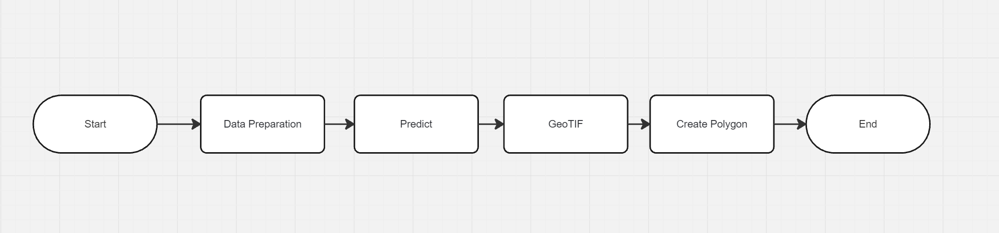
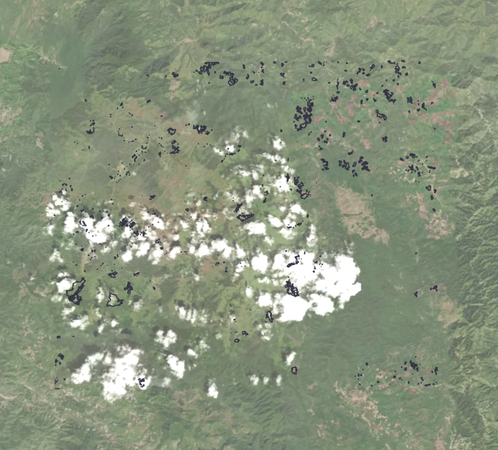

# RIDA Data En + Machine Learning

### Prerequisites
- pandas
- numpy
- matplotlib
- pickle
- os
- geopandas
- reverse_geocoder
- pycountry
- pymysql
- random
- math
- logging
- shutil
- re
- fiona
- rasterio
- shapely
- collections
- IPython
- sklearn
- scipy
- pyproj
- threading
- time
- skimage
- warnings
- csv
- dask
- concurrent.futures
- waterdetect
- subprocess
- datetime
- ast
- gdl

<br>
- Also can run on `./test.ipynb` notebook

### Imports & Settings


```python
import pandas as pd
import numpy as np
import matplotlib.pyplot as plt
import pickle
import os
import geopandas as gpd
import reverse_geocoder as rg
import pycountry
import pymysql
import random
import math
import numpy as np
import logging
import shutil
import re
import fiona
import rasterio
import fiona


from shapely.geometry import MultiPoint , shape, mapping
from collections import Counter
from IPython.display import display
from sklearn import metrics
from sklearn.metrics import silhouette_score
from sklearn.cluster import KMeans, DBSCAN
from scipy.ndimage import label
from rasterio.features import shapes
from rasterio.plot import show
from shapely.geometry import shape, mapping
from scipy.ndimage import label
from pyproj import Transformer, CRS


from image_processing import data_preparation
import sentinel_process

logging.basicConfig(level=logging.INFO, format='%(asctime)s - %(levelname)s - %(message)s')
logger = logging.getLogger()
```

### Data Preparation




    'main.py' are contain big tree function which consists of "data_preparation from 'image_processing.py'" ,"predict_main from 'predict_module.py'" and the last one "create_polygon from 'create_polygon.py'"


    'data_preparation' function is image processing which will resample satellite image(jp2) all range into 10m
    and move into 'sentinel_process/Image' folder. And next step finction will call subprocess 'sentinel_process.py'.


    'sentinel_process.py' is subprocess file which are contain function 'process_bands' it will use 'sentinel_process/Image'
    folder for read raster from 'data_preparation' here is step of subprocess

    - Step 1 : Check all raster are in 'sentinel_process/Image' 
    - Step 2 : Generate water detect mask using waterdect library (concept and reference from Maurício Cordeiro)
    - Step 3 : Process_bands function is read all raster and combine band and save into GeoTiff 
    - Step 4 : Use water mask.tiff and combine.tiff merge together and which raster map to mask made value = 0
    - step 5 : Save .tif to 'raster' folder for predict and modeling step


    'predict_main' function is machine lerning process, The process of function are read rester then using ML for calculate which pixel in raster is burn and output in .tif which is contain burn location

    - Step 1 : The 'predict_main' will read tiff for 'raster' folder and get value of each band into 'df' 
    - Step 2 : The 'df' contain dataframe for predict by using pickle LGBM (Light GBM) which learning from training pipeline
    - Step 3 : Process burn location tif which contain metadata of area and save to 'raster_output'


    'create_polygon' function is using tif to convert into set of Shape file (cph,dbf,prj,shp,shx) 

    - Step 1 : 'create_polygon' will read .tif from 'raster_output' folder
    - Step 2 : Convert .tif to polygon
    - Step 3 : Test plot Shape file on online map https://mapshaper.org/
    


### Folder Structure

```python

RidaProject
     |_satellite_Image
     |_sentinel_process
          |_Image
          |_Raster_Burncon
     |_model
     |_WaterDectect
     |_raster
     |_raster_output
     |_polygon
```

### Main

```python
import pandas as pd
import numpy as np
import matplotlib.pyplot as plt
import pickle
import os
import geopandas as gpd
import reverse_geocoder as rg
import pycountry
import pymysql
from shapely.geometry import MultiPoint
from collections import Counter
from IPython.display import display
from sklearn import metrics
from sklearn.metrics import silhouette_score
from sklearn.cluster import KMeans, DBSCAN
import logging
import shutil
import re
import rasterio

from image_processing import data_preparation
from predict_module import predict_main
from create_polygon import create_polygon

# Setup logging
logging.basicConfig(level=logging.INFO, format='%(asctime)s - %(levelname)s - %(message)s')
logger = logging.getLogger()

def find_folders(base_dir):
    found_folders = []
    pattern = re.compile(r'^[A-Z0-9]{6}_\d{8}$')
    logger.info(f"Searching in base directory: {base_dir}")

    # List contents of base_dir
    logger.info(f"Contents of {base_dir}:")
    for item in os.listdir(base_dir):
        logger.info(f"  {item}")

    for item in os.listdir(base_dir):
        full_path = os.path.join(base_dir, item)
        if os.path.isdir(full_path):
            logger.info(f"Checking directory: {full_path}")
            if pattern.match(item):
                logger.info(f"Matched directory: {full_path}")
                found_folders.append(full_path)
            else:
                logger.info(f"Directory does not match pattern: {full_path}")

    return found_folders

def find_tif_file(directory):
    for root, dirs, files in os.walk(directory):
        for file in files:
            if file.endswith('.tif'):
                return os.path.join(root, file)
    return None

def main():

    base_dir = 'satellite_image'
    folder_paths = find_folders(base_dir)
    if not folder_paths:
        logger.warning(f"No folders found in {base_dir} matching the pattern TILECODE_DATE.")
        return

    output_folder_after = "sentinel_process/Image"  # Ensure the correct absolute path

    data_preparation(folder_paths, output_folder_after)
    print("Finish process prepared data.")
    print("Next stage to predict process.")

    

    try:
        shutil.rmtree('prepare_image')
        print(f"Removed directory: prepare_image")
    except FileNotFoundError:
        pass  # Skip if the directory does not exist

    try:
        shutil.rmtree('rename_image')
        print(f"Removed directory: rename_image")
    except FileNotFoundError:
        pass

    shutil.rmtree('sentinel_process')
    os.makedirs('sentinel_process')
    os.makedirs('sentinel_process/Image')
    print(f"Created directory: sentinel_process/Image")
    os.makedirs('sentinel_process/Raster_Burncon')
    print(f"Created directory: sentinel_process/Raster_Burncon")


    predict_main()
    print("Predict Done.")

    input_raster_path = find_tif_file('raster_output')
    if not input_raster_path:
        logger.error("No .tif file found in the specified directory.")
        return
    
    output_shapefile_path = r'polygon/burn_condition.shp'
    
    total_polygons, shown_polygons, total_area = create_polygon(input_raster_path, output_shapefile_path)
    
    print(f"Total number of polygons: {total_polygons}")
    print(f"Number of polygons shown: {shown_polygons}")
    print(f"Total burn area: {total_area:.2f} square meters")

    print("Done.")


main()


```

### Special Thank

https://medium.com/analytics-vidhya/creating-training-patches-for-deep-learning-image-segmentation-of-satellite-sentinel-2-imagery-d3dd368c9c64

### Resource 

https://mapshaper.org/

